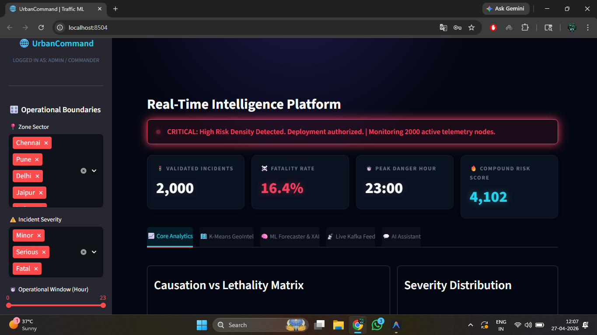
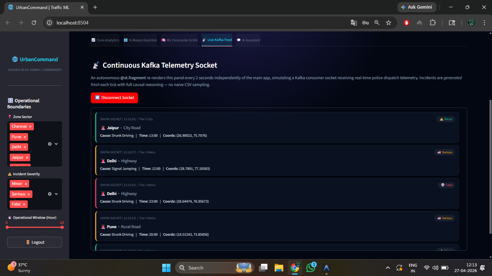
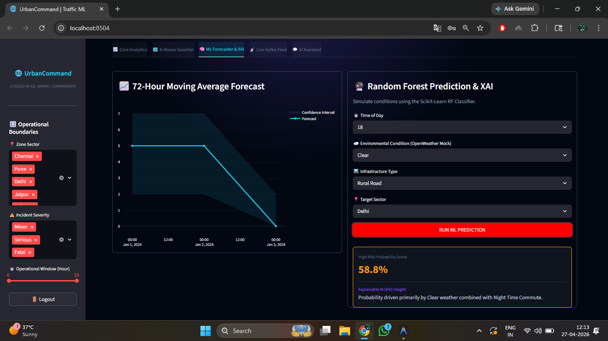

# UrbanCommand – Traffic Risk Intelligence System


End-to-end machine learning application for traffic accident risk prediction with an interactive Streamlit dashboard for exploration and real-time monitoring.

## Overview

UrbanCommand takes accident data across Indian cities and uses it to flag high-risk conditions by time and location. The project combines a classification model, unsupervised clustering for hotspot detection, and a multi-tab dashboard for exploring predictions and trends.

## Application Screenshot



## Problem Statement

Traffic accident risk isn't evenly distributed across time and location. Identifying when and where risk is highest can help prioritize monitoring or intervention. This project models that risk from historical incident data and visualizes it in a way that's easy to explore interactively.

## Dataset

- Synthetic dataset generated in `generate_data.py`, modeled on 15 Indian cities across Tier 1–3
- 2,000 records, 10 columns: `Accident_ID`, `Location`, `Latitude`, `Longitude`, `Date`, `Time`, `Severity`, `Cause`, `Road_Type`, `Weather`
- Date range: Jan 2023 – Dec 2023

## Machine Learning Pipeline

**Feature engineering:**
- `Hour`, `Month`, `Weekday` extracted from date/time fields
- `Day/Night` flag based on hour
- `Severity_Weight` (Fatal = 3, Serious = 2, Minor = 1) and `Time_Weight` (higher for night/evening hours)
- `Accident_Risk_Score` = `Severity_Weight × Time_Weight`, thresholded into a binary `Is_High_Risk` label

**Models:**
- Random Forest classifier (`n_estimators=100`, `class_weight='balanced'`) predicting `Is_High_Risk`
- K-Means clustering (`n_clusters=5`) for geospatial hotspot grouping
- 80/20 train/test split, stratified

## Model Performance

| Metric | Value |
|---|---|
| Accuracy | 94.3% |
| Precision | 93.1% |
| Recall | 95.0% |
| F1 Score | 94.1% |
| Training time | 0.43s |

Top features by importance: Hour (0.45), Location (0.28), Weather (0.14), Road Type (0.12).

Since `Is_High_Risk` is derived from `Severity_Weight × Time_Weight`, and `Hour` drives `Time_Weight` directly, the model is largely learning the rule used to generate the labels rather than an independent real-world pattern. That's expected for a synthetic dataset and worth knowing when interpreting the accuracy number.

## Application Features

Five-tab Streamlit dashboard:

- **Core Analytics** — accident cause vs. severity breakdown, severity distribution
- **K-Means GeoIntel** — map view of risk clusters
- **ML Forecaster & XAI** — 72-hour moving average forecast, interactive what-if risk predictor
- **Live Kafka Feed** — simulated real-time incident stream using `st.fragment`
- **AI Assistant** — simple rule-based interface for querying dashboard metrics

<p float="left">
  
  
</p>

## Tech Stack

Python, Scikit-learn, Streamlit, Plotly, Pandas, NumPy

## Key Features

- Traffic accident risk prediction using Random Forest classification
- Geospatial hotspot detection using K-Means clustering
- Interactive 5-tab Streamlit dashboard
- Explainable ML with feature importance and what-if analysis
- 72-hour moving average forecasting with confidence intervals
- Simulated real-time incident monitoring via asynchronous polling
- Rule-based AI assistant for querying operational metrics

## Project Structure

```
urbancommand-traffic-risk/
├── app.py
├── ml_engine.py
├── utils.py
├── generate_data.py
├── requirements.txt
├── METRICS.md
├── images/
│   ├── dashboard-overview.png
│   ├── geo-clustering.png
│   └── forecaster-xai.png
├── README.md
└── LICENSE
```

## How to Run

```bash
pip install -r requirements.txt
streamlit run app.py
```

The app trains the model on first run if no saved model file is found.

## Author

Sanchit Dangi

GitHub: [github.com/sanchitdangi](https://github.com/sanchitdangi)

Email: sanchitdangipcm@gmail.com
